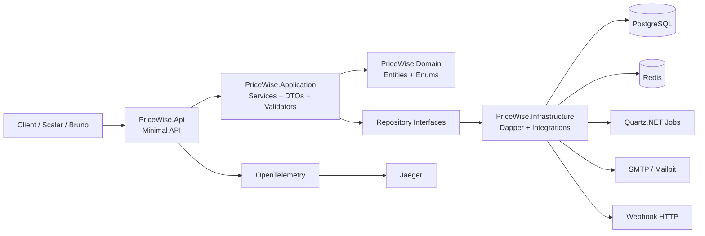
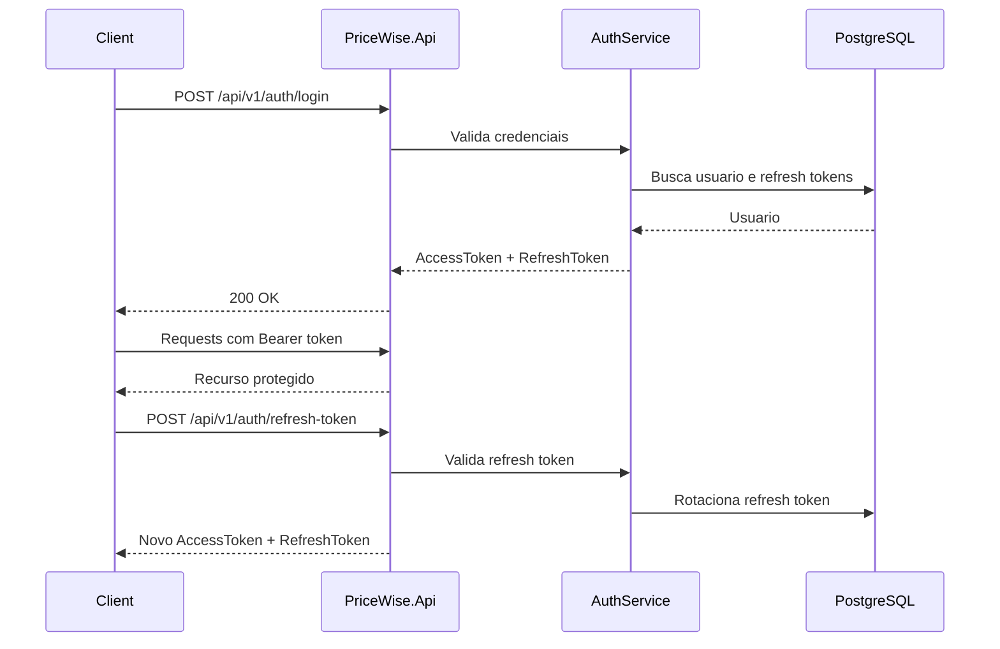
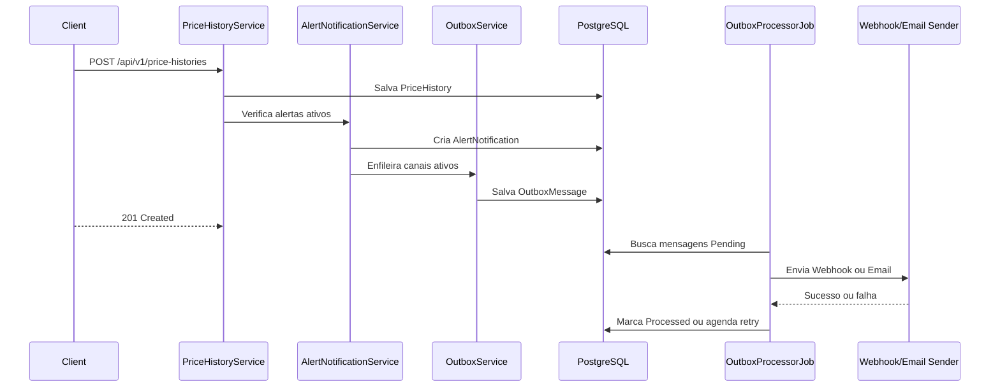
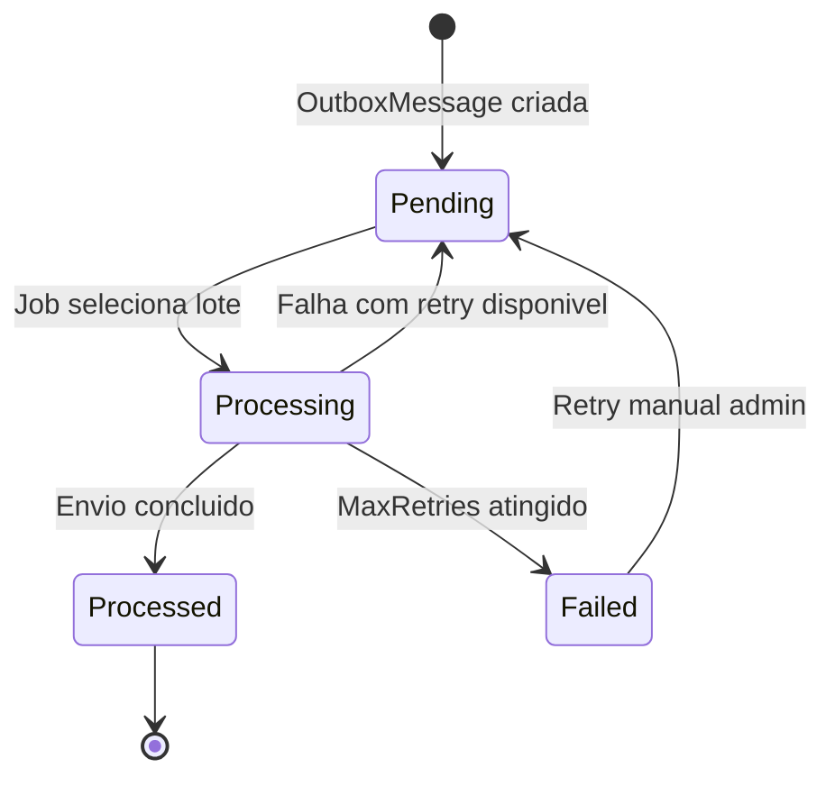

# PriceWise API

[](https://github.com/AndreLBrito/PriceWise-API/actions/workflows/ci.yml)


PriceWise API e uma API REST para monitoramento de precos, historico de variacoes e alertas personalizados por usuario. O projeto foi criado como entrega de portfolio para demonstrar arquitetura em camadas, seguranca, observabilidade, resiliencia de integracoes, testes e ambiente local completo com Docker.

## Objetivos do projeto

- Demonstrar uma API profissional em .NET 10 usando Minimal API.
- Modelar um dominio realista de monitoramento de precos sem depender de Entity Framework.
- Aplicar padroes de arquitetura como Services, Repositories, Result Pattern e Outbox Pattern.
- Entregar um ambiente reproduzivel com PostgreSQL, Redis, Jaeger, Mailpit e Docker Compose.
- Mostrar maturidade tecnica com JWT, auditoria, rate limiting, OpenTelemetry, CI/CD e testes.

## Stack utilizada

- .NET 10
- ASP.NET Core Minimal API
- PostgreSQL
- Dapper
- FluentMigrator
- FluentValidation
- Serilog
- Scalar
- JWT Authentication
- Redis Cache
- Quartz.NET
- OpenTelemetry
- MailKit
- xUnit
- FluentAssertions
- Testcontainers
- GitHub Actions
- Docker Compose
- Bruno API Client

## Arquitetura

```text
src/
|-- PriceWise.Api              Minimal API, endpoints, auth, rate limiting, OpenAPI/Scalar
|-- PriceWise.Application      DTOs, validators, services, contracts, Result Pattern
|-- PriceWise.Domain           Entities, enums e regras de dominio
|-- PriceWise.Infrastructure   Dapper, PostgreSQL, migrations, Redis, Quartz, notificacoes
`-- PriceWise.Tests            Testes unitarios e integracao com Testcontainers
```



## Funcionalidades

- Authentication com register, login, refresh token, logout, troca de senha e revogacao de tokens.
- Products para cadastro de produtos monitorados por usuario.
- Stores para cadastro de lojas monitoradas por usuario.
- PriceHistory para registrar precos por produto e loja.
- PriceAlerts para definir preco alvo por produto.
- AlertNotifications disparadas quando o preco encontrado atinge o alvo.
- NotificationChannels com Webhook e Email.
- Outbox Pattern para envio resiliente de notificacoes.
- Dashboard com estatisticas agregadas.
- Exportacao CSV de produtos, lojas, historico e notificacoes.
- PriceCheck com Quartz.NET e `MockPriceProvider`.
- Admin Users, Audit Logs e Outbox administrativa.
- Seed de dados para demonstracao.
- Versionamento `/api/v1` com compatibilidade para `/api`.

## Seguranca

- JWT Authentication.
- Roles `User` e `Admin`.
- Policies como `AdminOnly`, `AuthenticatedUser`, `PriceCheckManagement` e `TelemetryManagement`.
- Password hashing.
- Refresh tokens revogaveis.
- Rate limiting por usuario autenticado ou IP.
- Respostas padronizadas em portugues.
- Tratamento global de excecoes.
- CorrelationId via header `X-Correlation-Id`.
- AuditLog com sanitizacao de campos sensiveis como `Password`, `PasswordHash`, `Token` e `RefreshToken`.

### Fluxo de autenticacao



## Observabilidade

- Serilog para logs estruturados.
- OpenTelemetry para traces e metricas.
- Instrumentacao de ASP.NET Core, HttpClient, services e jobs.
- Jaeger via OTLP no Docker Compose.
- Health checks para API, PostgreSQL, Redis e telemetria.
- Metricas customizadas para criacao de produtos, lojas, historicos, alertas, notificacoes e price checks.

Endpoints:

- `GET /health`
- `GET /health/telemetry`
- `GET /api/v1/telemetry/info`

## Integracoes e processamento robusto

O projeto usa Outbox Pattern para desacoplar a criacao de notificacoes do envio real por Webhook ou SMTP. Isso protege o fluxo principal contra falhas externas.

### Fluxo de alerta de preco



### Fluxo Outbox Pattern



Configuracao principal:

```json
"Outbox": {
  "Enabled": true,
  "IntervalInSeconds": 30,
  "MaxRetries": 5,
  "BatchSize": 20
}
```

## Como executar localmente

Requisitos:

- .NET 10 SDK
- Docker Desktop, para PostgreSQL/Redis e testes de integracao

Suba dependencias com Docker:

```powershell
docker compose up -d postgres redis jaeger mailpit
```

Execute a API:

```powershell
dotnet run --project src/PriceWise.Api/PriceWise.Api.csproj
```

Health check:

```http
GET http://localhost:8080/health
```

## Como executar via Docker

Copie o arquivo de ambiente:

```powershell
Copy-Item .env.example .env
```

Suba o ambiente completo:

```powershell
docker compose up --build
```

Ou use os scripts:

```powershell
.\start.ps1
```

```bash
./start.sh
```

Servicos locais:

- API: `http://localhost:8080`
- Scalar: `http://localhost:8080/scalar`
- Jaeger: `http://localhost:16686`
- Mailpit: `http://localhost:8025`
- PostgreSQL: `localhost:5432`
- Redis: `localhost:6379`

As migrations rodam automaticamente na inicializacao da API. O seed de demonstracao roda em desenvolvimento quando `DataSeed:Enabled` esta habilitado.

## Docker para producao

O arquivo `docker-compose.prod.yml` contem uma configuracao base para producao, sem seed demo por padrao e com variaveis sensiveis exigidas via ambiente.

Exemplo:

```powershell
docker compose -f docker-compose.prod.yml up --build -d
```

Variaveis obrigatorias para producao:

- `POSTGRES_DB`
- `POSTGRES_USER`
- `POSTGRES_PASSWORD`
- `JWT_SECRET`

Recomendacoes:

- Use um `JWT_SECRET` forte e exclusivo por ambiente.
- Mantenha `DataSeed__Enabled=false` em producao.
- Configure SMTP real apenas via variaveis de ambiente.
- Publique a imagem em um registry quando houver alvo de deploy definido.

## Scalar

Scalar fica disponivel em ambiente `Development`:

```http
http://localhost:8080/scalar
```

Para testar endpoints protegidos, faca login e use o token no formato:

```text
Bearer {accessToken}
```

## Jaeger

No Docker Compose, o OpenTelemetry exporta traces para o Jaeger via OTLP:

```http
http://localhost:16686
```

Servico esperado no Jaeger:

```text
PriceWise.Api
```

## Mailpit

Mailpit captura e-mails em desenvolvimento:

- SMTP: `mailpit:1025`
- UI: `http://localhost:8025`

Para habilitar envio local:

```env
EMAIL_NOTIFICATIONS_ENABLED=true
EMAIL_NOTIFICATIONS_HOST=mailpit
EMAIL_NOTIFICATIONS_PORT=1025
EMAIL_NOTIFICATIONS_USE_SSL=false
```

## Colecao de API

A colecao Bruno esta versionada em:

```text
bruno/PriceWise API
```

Use o ambiente `Local`. O request `Authentication/Login` salva `accessToken` e `refreshToken` no ambiente quando possivel. Para endpoints administrativos, execute `Admin/Login Admin`.

Usuarios de demonstracao:

- User: `demo@pricewise.com` / `Demo@123456`
- Admin: `admin@pricewise.com` / `Admin@123456`

## Configuracao de ambiente

Arquivos de exemplo:

- `.env.example`
- `src/PriceWise.Api/appsettings.Development.example.json`

As principais secoes configuraveis sao:

- `Database`
- `Jwt`
- `AuthenticationSecurity`
- `AdminSeed`
- `DataSeed`
- `Redis`
- `Telemetry`
- `RateLimiting`
- `PriceCheck`
- `PriceProvider`
- `Outbox`
- `WebhookNotifications`
- `EmailNotifications`
- `CsvExport`

## Testes

Executar build:

```powershell
dotnet build PriceWise.slnx
```

Executar suite completa:

```powershell
dotnet test PriceWise.slnx
```

Executar apenas testes unitarios:

```powershell
dotnet test PriceWise.slnx --filter "FullyQualifiedName!~Integration"
```

Os testes de integracao usam Testcontainers com PostgreSQL real. Para executa-los localmente, mantenha o Docker Desktop iniciado.

## Cobertura de testes

Gerar cobertura local no Windows:

```powershell
.\scripts\coverage.ps1
```

Gerar cobertura local no Linux/macOS:

```bash
./scripts/coverage.sh
```

Os resultados ficam em:

```text
artifacts/TestResults
```

## CI/CD

O workflow `CI` roda em push e pull request para `main`:

- Restore
- Format check
- Build em Release
- Testes em Release
- Publicacao de resultados como artifact
- Validacao do Docker Compose

Os runners do GitHub Actions possuem Docker disponivel para os testes com Testcontainers.

## Roadmap futuro

- Implementar provider real de precos por loja.
- Publicar imagem Docker em registry.
- Adicionar deploy automatizado para ambiente cloud.
- Criar painel frontend para consumo da API.
- Adicionar notificacoes por WhatsApp ou Telegram.
- Persistir historico detalhado de tentativas de envio da Outbox.
- Adicionar dashboards externos com Prometheus/Grafana.

## Portfolio tecnico

### Problemas resolvidos

- Monitorar produtos e lojas por usuario com isolamento de dados.
- Registrar historico de precos e gerar indicadores consolidados.
- Disparar alertas sem bloquear o fluxo principal da API.
- Operar integracoes externas com tolerancia a falhas.
- Entregar ambiente local reproduzivel para avaliacao tecnica.

### Decisoes arquiteturais

- Minimal API para endpoints enxutos e diretos.
- Dapper para controle explicito de SQL e performance.
- FluentMigrator para versionamento de banco.
- Result Pattern para reduzir excecoes em regras de aplicacao.
- Outbox Pattern para robustez em Webhook e Email.
- Redis para cache distribuido de consultas frequentes.
- Quartz.NET para jobs recorrentes.
- OpenTelemetry para traces e metricas.

### Principais desafios

- Manter baixo acoplamento entre modulos de negocio e infraestrutura.
- Garantir que mensagens ao usuario fiquem em portugues enquanto o codigo permanece em ingles.
- Evitar vazamento de dados entre usuarios nas consultas e no cache.
- Projetar retries sem duplicar notificacoes.
- Criar um ambiente Docker completo sem depender de instalacoes locais de PostgreSQL ou Redis.

### Tecnologias demonstradas

- .NET 10, ASP.NET Core Minimal API e JWT.
- PostgreSQL, Dapper e FluentMigrator.
- Redis, Quartz.NET, OpenTelemetry e Serilog.
- MailKit, Webhook HTTP e Outbox Pattern.
- xUnit, FluentAssertions, Testcontainers e GitHub Actions.
- Docker, Docker Compose, Scalar e Bruno.

### Diferenciais tecnicos

- Arquitetura em camadas clara para portfolio.
- API versionada com respostas padronizadas.
- Auditoria com correlationId e sanitizacao de dados sensiveis.
- Observabilidade pronta para investigacao de problemas.
- Colecao de API versionada com fluxo de login.
- Ambiente completo para demonstracao com um unico comando.
